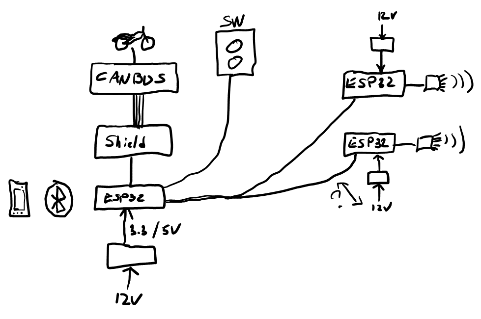

# Prototype for Auxiliary Lights

Info for the first prototype.

## Intro

Newer motorcycles have better lights than before, but it can't compete against dedicated external auxiliary lights.  The problem is cost, a full set of auxiliary LED lights, with some "automation" and convention can be up to 1500$ (Canadian dollar).

The plan is to build them myself.  4 auxiliary lights: 2 to spot things way in front at a distance (on highways for example), and 2 to spot things on the side of the road.

- Set 1 (left/right) for long distance (spot), mounted higher on the bike (Version 1.0)
- Set 2 (left/right) for sides (flood), mounted lower. (Version 2.0)

These lights will be controllable from a general switch on the handlebar, automatically from the bike's computer and from a phone.

- The handlebar switch will have an off/auto/on button, and a +/- intensity button.
- The bikes computer and sensors will also drive the lights
- An app on a mobile phone will do the same as above, but more finesse and control.

## Versions

I'd love to build everything one time and move on, but there's nothing better than:

> Start small, make it work, then make it work better.

### Version 1.0

2 auxiliary lights, mounted high on the crash bars.  Control would be done via switch on the handlebar.

### Version 1.1

Add integration with the bike's computer (ODB2/CanBus):

- turn on/dim/off with daylight sensor
- turn on/dim when bike is set to high/low beam
- turn on/dim side lights when turn signals on at low speed

### Version 2.0

Add 2 auxiliary lights for the fog and for side illumination (tight curves).

### Future versions

- Android phone app
  - control
  - settings (dim intensity, etc.)
  - firmware update ?
  - logging
    - fuel consumption (geek) <-> gps <-> speed
  - audio feedback
    - "gear 5"
  - voice control
    - "Aziz, lights"

## The plan

One main computer, connected to a switch, connected to 2 pods (Left/Right).

### Pods

Each housing is a named a pod.  Each pod contains the LEDs, lenses and a controller.  The controller is responsible of handling which LED is turned on, off or at what intensity.

The [ESP32](https://www.espressif.com/en/products/socs/esp32) is currently the chosen computer for the pods.

The LEDs: CREE 

### Main unit

The Main unit controller is the brain that instructs each pod individually, based on various input and settings.  The requirements for the computer [IoT](https://en.wikipedia.org/wiki/Internet_of_things):

- cheap
- easy to program
  - C, Python
  - modern IDE (Visual Studio, Visual Studio Code, Arduino IDE)
  - USB interface with PC
- Bluetooth
- Interface capable to connect to ODB-II or CAN Bus, via Shield
- Breadboard friendly

The [ESP32](https://www.espressif.com/en/products/socs/esp32) is currently the chosen computer for the main unit.

### Communication between computers

The Main unit will send an instruction to the pod computers, and the pod computer will do the turning on/off and dimming of individual LEDs.  I'm still debating on the transportation medium:

- A physical cable
- Bluetooth
- other: RF, Wifi, etc.

The advantage of a physical cable is the reliability.  The downside is "more cables": pain of routing, visually unpleasant, source of failure (corrosion, water, accident).

The advantage of Bluetooth is less cables.  The downside of Bluetooth is the pairing nightmare, speed, and connectivity glitches.

Since the Pods will require 12V anyway, maybe running a 3-pair cable directly from the Main unit is an attractive alternative.

1. Gnd
1. 12V
1. Data

### Switch

2 buttons for now.

- Plus (+) increase
- Minus (-) decrease

Off <-> Daytime <-> Low beam <-> High beam <-> Rally

#### Option: Whoops mode

Fast click any (+) or (-) would dim down the lights:

| Off |     | Daytime |     | Low beam |     | High Beam |     | Rally |
| --- | --- | ---     | --- | ---      | --- | ---       | --- | ---   |
|     |     |         |     | Low beam |  <- |           | <-  | Rally |
|     |     |         |     | Low beam |  <- | High Beam | |
|     |     | Daytime | <-  | Low beam | | |
| Off | <-  | Daytime |  

## Features

In high beam mode - the bike is alone in the dark, the idea is to prevent accidents as much as possible, obstacles far up front and animals on the side.

In low beam, we don't want to affect others in front of us.

Question: In low beam, what do we do with the top right ?  We want some light to detect people walking for example.

## Outstanding questions

Research: in low beam, how to balance the viewing experience without affecting others.

Research: low beam scenario, the bike is approaching a hill, we want to see what's above the "low beam line".

Research: high speed versus low speed.  Should the lighting pattern vary with speed ?

Research: Windy roads.  In curves, should the inclination of the bike affect the lighting to reduce the inner-circle blind spot ?

### Build

Each pod will controlled individually, for features like turning, lane changing, etc.

Each pod will have their own set of LEDs, specs and power requirements.  Bikes typically run with 12VTo minimize the risk of interferences between the main unit and the pod, and for ease of programming, each pod could be connected to the main unit via a 3 wire cable: a 12V power, Gnd, Data, or go for Bluetooth?

### Pod Housing

Thinking of 3D printing, PETG resin.  But, if heat dissipation is needed, might be difficult perform.

Question: What's the relationship between the LED orientation with the lens ?  Should the lens control 100% (Single-Point Diamond Turning) light direction, or is there a combination between lens construction and LED location/orientation?

### Pod Lens

This is the "Pod" protective lens, not the individual LED lenses.

Polycarbonate seems the obvious choice for a lens.

Question: Can a 3D printer print polycarbonate lenses or is it better to buy directly from a manufacturer ?

### Pod LED pattern

Thinking of 3 LED layout patterns: Square, rectangle or round.

Will depend on the size of LEDs and throughput (Lumen), the lens capabilities versus LED orientation requirements.

- Square pattern: 1, 4, 9, 16  
- Rectangle patterns: 2, 6, 7, 15
- Round: 1, 5, 12

### LED questions

Many questions around LEDs

#### Heat

Question: Do LEDs generate a lot of heat ?  If so, need to find a way to include heat dissipation in the housing design.

#### Intensity

Question: Are LED variable intensity or fixed ?  If fixed, need to find a way to turn on/off LEDs individually to simulate gradation.

Partial answer: from CREE's literature (bellow), the input voltage (V) affects the current consumed (mA), and the current consumed (mA) affects the relative light intensity.

- 2.6V = 100 mA = 10% intensity
- 2.8V = 1000 mA = 100% intensity
- 3.1V = 2500 mA = 200% intensity

Question: What 200% intensity mean ?

#### LED life

At full intensity, what is the LED's life ?  What affects the LED's light? Does the LED loose lumens gradually over time ?  Might want to think about having a round-robin of active LEDs

### Cree XLamp XP-L LEDs

The specs for the LEDs from [cree.com](https://www.cree.com/led-components/media/documents/ds-XPL.pdf).

- CCT: Chromacity
  - Warm White: 2700K - 3500K
  - Neutral White: 3750K - 5000K
  - Cool White 5700K - 6200K
- Flux: Light output, in Lumens

Thinking of Kit 51, CCT 6200K

### Lenses

Khatod

A mix of Ultra Narrow, Narrow, Wide and flood.

Question: How to fine tune/adjust lens orientation ?  Is there such a thing as a "lens mount" ?

### Main Unit

Contemplating between various devices:

- Arduino
- ESP32 (preferred option)
  - [ESP32-WROOM](https://www.espressif.com/en/products/modules/esp32)
  - CAN bus connectivity TI [SN65HVD230DR](http://www.ti.com/general/docs/lit/getliterature.tsp?baseLiteratureNumber=SLOS346&fileType=pdf) transceiver chip ?
